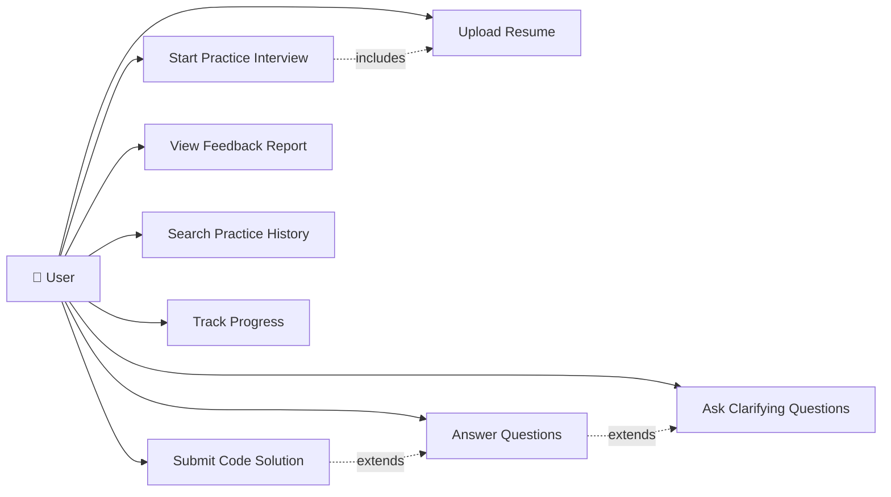
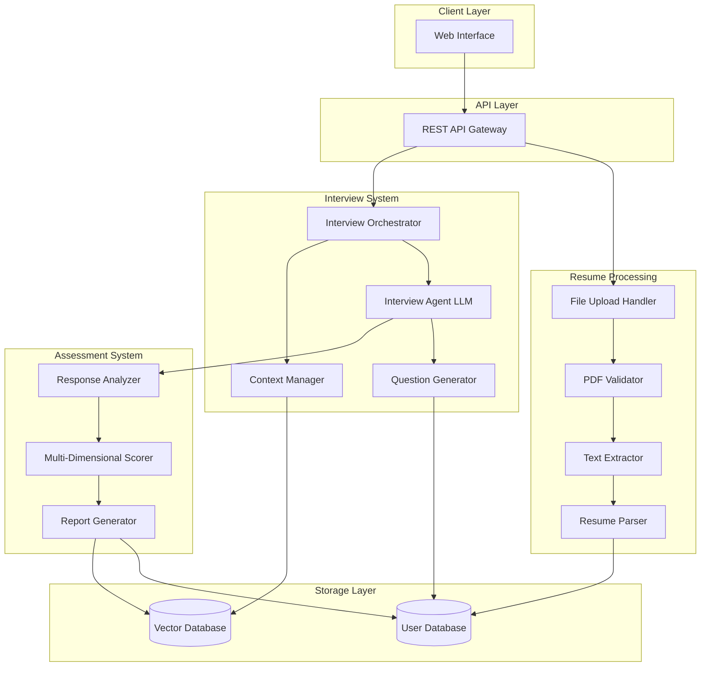

# Design Document: Mock Interview Agent System (PERN Stack)

## Overview

The Mock Interview Agent System is a full-stack web application built using the PERN stack (PostgreSQL, Express.js, React.js, Node.js). The system provides AI-powered mock interview experiences by leveraging AWS Bedrock Claude 3 Haiku for natural language processing and ChromaDB for vector-based storage of interview interactions.

The architecture follows a three-tier pattern:
- **Frontend**: React.js single-page application (JavaScript, no TypeScript) with responsive design
- **Backend**: Express.js REST API with JWT authentication
- **Data Layer**: PostgreSQL for relational data and ChromaDB for vector embeddings

Key design principles:
- **LLM-first approach**: AWS Bedrock as PRIMARY extraction method, regex as fallback
- **Performance-optimized**: Resume processing <5 seconds, question generation <3 seconds
- **Stateless API design** with JWT authentication
- **Responsive and interactive** user interface
- **Free-tier deployment** compatibility

## Technology Stack

### Core Technologies

**Backend Framework:**
- Node.js 18+ with Express.js for REST API
- Async/await for concurrent request handling
- express-validator for request validation

**LLM & AI:**
- AWS Bedrock (Claude 3 Haiku) - PRIMARY extraction method
- AWS SDK for Bedrock integration
- ChromaDB for vector embeddings

**PDF Processing:**
- pdf-parse for text extraction
- Regex patterns for fallback extraction

**Databases:**
- PostgreSQL 14+ for relational data (structured data)
- ChromaDB for vector database (embeddings and semantic search)

**Frontend:**
- React 18+ with JavaScript (NO TypeScript)
- CSS3 for styling (custom, no framework)
- Axios for API requests
- React Router for navigation

**Infrastructure:**
- Vercel for frontend deployment (free tier)
- Render or Railway for backend deployment (free tier)
- Render/Railway/Supabase for PostgreSQL (free tier)

**Development Tools:**
- nodemon for development
- npm for package management

### Why These Technologies?

**PERN Stack**: Chosen because:
- JavaScript everywhere (frontend + backend)
- Fast development with no TypeScript overhead
- Excellent async support for LLM calls
- Easy deployment on free platforms
- Large community and resources

**AWS Bedrock**: Chosen for LLM because it:
- Provides Claude 3 Haiku (fast and accurate)
- Has free tier for first 2 months
- Offers reliable API with good uptime
- Supports structured JSON extraction

**ChromaDB**: Chosen for vector database because it's:
- Open-source and free
- Easy to integrate with Node.js
- Supports multiple embedding models
- Provides efficient similarity search
- Has good documentation and community support

**Express.js**: Chosen for backend because it:
- Lightweight and fast
- Huge ecosystem of middleware
- Easy to integrate with AWS SDK
- Simple REST API development

**PostgreSQL**: Chosen for structured data because it:
- Provides ACID compliance for data integrity
- Supports JSONB fields for flexible resume schema
- Has excellent performance and reliability
- Offers strong community and tooling support
- Free tier available on multiple platforms

## Hardware & Software Requirements

### Development Environment

**Minimum Requirements:**
- CPU: 4 cores (Intel i5 or equivalent)
- RAM: 8 GB
- Storage: 20 GB SSD
- OS: Linux (Ubuntu 22.04+), macOS 12+, or Windows 11

**Recommended Requirements:**
- CPU: 8 cores (Intel i7/i9 or AMD Ryzen 7/9)
- RAM: 16 GB
- Storage: 50 GB SSD

**Software:**
- Node.js 18+ and npm
- PostgreSQL 14+
- Git
- Code editor (VS Code recommended)
- AWS Account with Bedrock access
- Node.js 18+
- Docker Desktop
- PostgreSQL 15+
- Git
- VS Code or PyCharm (with Kiro extension)

### Production Environment

**Application Server (per instance):**
- CPU: 4-8 vCPUs
- RAM: 16-32 GB
- Storage: 100 GB SSD
- OS: Ubuntu 22.04 LTS

**Database Server:**
- CPU: 8-16 vCPUs
- RAM: 32-64 GB
- Storage: 500 GB SSD (with auto-scaling)
- Backup: Daily automated backups with 30-day retention

**Vector Database Server:**
- CPU: 4-8 vCPUs
- RAM: 16-32 GB (depends on embedding size and dataset)
- Storage: 200 GB SSD
- GPU: Optional for faster embedding generation

**Load Balancer:**
- CPU: 2 vCPUs
- RAM: 4 GB
- Managed service (AWS ALB, GCP Load Balancer) recommended

**File Storage:**
- Object storage (AWS S3, GCP Cloud Storage, Azure Blob)
- Estimated: 1 TB for 10,000 resumes (100 KB average per PDF)

### Scaling Considerations

**Small Scale (100-500 users):**
- 2 application servers
- 1 database server
- 1 vector database server
- Shared Redis instance

**Medium Scale (500-5,000 users):**
- 4-6 application servers (auto-scaling)
- 1 primary + 1 replica database server
- 2 vector database servers
- Dedicated Redis cluster

**Large Scale (5,000+ users):**
- 10+ application servers (auto-scaling)
- Database cluster with read replicas
- Distributed vector database
- Redis cluster with sharding
- CDN for static assets

## Cost Estimation

### Development Phase (3-6 months)

**Team:**
- 2 Backend Developers: $120k-180k/year × 2 = $240k-360k
- 1 Frontend Developer: $100k-150k/year = $100k-150k
- 1 ML/AI Engineer: $140k-200k/year = $140k-200k
- 1 DevOps Engineer (part-time): $60k-90k/year = $60k-90k
- 1 QA Engineer: $80k-120k/year = $80k-120k
- **Total Team Cost: $620k-1,020k/year** (prorated for 3-6 months: $155k-510k)

**Infrastructure (Development):**
- Cloud services (AWS/GCP): $500-1,000/month
- LLM API costs (OpenAI/Anthropic): $1,000-2,000/month for testing
- Development tools & licenses: $200-500/month
- **Total Infrastructure: $1,700-3,500/month × 6 = $10k-21k**

**Total Development Cost: $165k-531k**

### Operational Costs (Monthly)

**Small Scale (100-500 users, ~50 interviews/day):**

*Infrastructure:*
- Application servers (2× t3.large): $140/month
- Database (db.t3.large): $140/month
- Vector DB (t3.large): $70/month
- Redis (cache.t3.small): $30/month
- Load balancer: $20/month
- S3 storage (100 GB): $3/month
- Bandwidth: $50/month
- **Subtotal Infrastructure: $453/month**

*LLM API Costs:*
- GPT-4 API: ~$0.03/1K tokens input, $0.06/1K tokens output
- Average interview: ~10K tokens input, 5K tokens output = $0.60/interview
- 50 interviews/day × 30 days = 1,500 interviews/month
- **LLM Costs: $900/month**

*Other Services:*
- Monitoring (Datadog/New Relic): $100/month
- Error tracking (Sentry): $30/month
- Email service (SendGrid): $20/month
- **Subtotal Services: $150/month**

**Total Small Scale: ~$1,500/month**

---

**Medium Scale (500-5,000 users, ~500 interviews/day):**

*Infrastructure:*
- Application servers (4× t3.xlarge, auto-scaling): $600/month
- Database (db.r5.xlarge + replica): $800/month
- Vector DB (2× t3.xlarge): $300/month
- Redis cluster: $150/month
- Load balancer: $40/month
- S3 storage (1 TB): $25/month
- Bandwidth: $300/month
- CDN (CloudFront): $100/month
- **Subtotal Infrastructure: $2,315/month**

*LLM API Costs:*
- 500 interviews/day × 30 days = 15,000 interviews/month
- **LLM Costs: $9,000/month**

*Other Services:*
- Monitoring: $300/month
- Error tracking: $100/month
- Email service: $100/month
- Backup storage: $50/month
- **Subtotal Services: $550/month**

**Total Medium Scale: ~$11,865/month**

---

**Large Scale (5,000+ users, ~2,000 interviews/day):**

*Infrastructure:*
- Application servers (10× c5.2xlarge, auto-scaling): $3,000/month
- Database cluster (db.r5.4xlarge + 2 replicas): $4,000/month
- Vector DB cluster: $1,500/month
- Redis cluster (sharded): $500/month
- Load balancer (multi-AZ): $100/month
- S3 storage (5 TB): $125/month
- Bandwidth: $1,500/month
- CDN: $500/month
- **Subtotal Infrastructure: $11,225/month**

*LLM API Costs:*
- 2,000 interviews/day × 30 days = 60,000 interviews/month
- **LLM Costs: $36,000/month**
- Note: At this scale, consider fine-tuning and self-hosting smaller models to reduce costs

*Other Services:*
- Monitoring: $1,000/month
- Error tracking: $300/month
- Email service: $300/month
- Backup storage: $200/month
- Security & compliance: $500/month
- **Subtotal Services: $2,300/month**

**Total Large Scale: ~$49,525/month**

### Cost Optimization Strategies

1. **LLM Costs** (largest expense):
   - Fine-tune smaller open-source models (Llama 2, Mistral) for specific tasks
   - Self-host models on GPU instances for high-volume usage
   - Implement caching for similar questions
   - Use cheaper models for non-critical tasks (e.g., GPT-3.5 for preprocessing)
   - Potential savings: 50-70% at scale

2. **Infrastructure**:
   - Use spot instances for non-critical workloads
   - Implement auto-scaling to match demand
   - Use reserved instances for predictable workloads (save 30-50%)
   - Optimize database queries and add caching
   - Compress and deduplicate stored data

3. **Development**:
   - Use Kiro for AI-assisted development to increase productivity
   - Implement comprehensive testing to reduce bug-fixing costs
   - Use managed services to reduce DevOps overhead

### Revenue Model Considerations

To achieve profitability, consider pricing tiers:

**Freemium:**
- 1 interview/month free
- Basic assessment report
- Target: User acquisition

**Professional ($29-49/month):**
- 10 interviews/month
- All interview types
- Detailed reports
- Target: Individual job seekers

**Business ($199-499/month):**
- 100 interviews/month
- Custom interview types
- API access
- Analytics dashboard
- Target: Small companies, recruiters

**Enterprise (Custom pricing):**
- Unlimited interviews
- White-label option
- Dedicated support
- Custom integrations
- Target: Large corporations, universities

**Break-even Analysis (Medium Scale):**
- Monthly costs: ~$12,000
- Required revenue: $12,000 / 0.7 (30% margin) = ~$17,000/month
- If average revenue per user = $40/month
- Required paying users: 425 users
- With 10% conversion from free tier: Need ~4,250 total users

## Overview

The Mock Interview Agent System is a comprehensive AI-powered interview platform that processes candidate resumes, conducts adaptive multi-dimensional interviews, and provides detailed assessments. The system consists of four main subsystems:

1. **Resume Processing Pipeline**: Handles PDF upload, text extraction, parsing, and storage
2. **Interview Agent**: LLM-based conversational agent that conducts interviews
3. **Assessment Engine**: Multi-dimensional evaluation system for candidate responses
4. **Storage Layer**: Dual storage with user database for structured data and vector database for semantic search

The system supports multiple interview types (HR behavioral, technical deep-dive, coding assessment, stress scenarios) and dynamically adapts questions based on resume content and conversation context.

## Architecture

### Use Case Diagram



### Detailed Use Case Descriptions

**UC1: Upload Resume**
- Actor: User
- Description: User uploads their resume in PDF format for processing
- Preconditions: None
- Postconditions: Resume is parsed and stored in the system
- Main Flow:
  1. User selects PDF file
  2. System validates file format
  3. System extracts and parses resume data
  4. System stores structured data
  5. System confirms successful upload

**UC2: Start Practice Interview**
- Actor: User
- Description: User initiates a practice interview session
- Preconditions: Resume must be uploaded
- Postconditions: Practice session is created and first question is presented
- Main Flow:
  1. User selects interview type
  2. System retrieves user's resume data
  3. System initializes practice session
  4. System generates first question based on resume
  5. System presents question to user

**UC3: Answer Questions**
- Actor: User
- Description: User responds to interview questions
- Preconditions: Practice session must be active
- Postconditions: Answer is analyzed and next question is generated
- Main Flow:
  1. User provides answer
  2. System analyzes answer quality
  3. System updates conversation context
  4. System generates next question based on answer
  5. System presents next question

**UC4: Submit Code Solution**
- Actor: User
- Description: User submits code for a coding challenge
- Preconditions: Coding round must be active
- Postconditions: Code is analyzed and follow-up questions are generated
- Main Flow:
  1. User writes code solution
  2. User submits code
  3. System analyzes logic and complexity
  4. System generates questions about design decisions
  5. System presents follow-up questions

**UC5: Ask Clarifying Questions**
- Actor: User
- Description: User asks questions to clarify interview questions
- Preconditions: Practice session must be active
- Postconditions: Clarification is provided and engagement is recorded
- Main Flow:
  1. User asks clarifying question
  2. System records engagement behavior
  3. System provides clarification
  4. System continues interview

**UC6: View Feedback Report**
- Actor: User
- Description: View comprehensive feedback report after practice interview
- Preconditions: Practice session must be completed
- Postconditions: Report is displayed
- Main Flow:
  1. User requests feedback report
  2. System retrieves interview data
  3. System generates comprehensive report
  4. System displays scores, strengths, weaknesses

**UC7: Search Practice History**
- Actor: User
- Description: Search through past practice interviews
- Preconditions: Practice interview data must exist in vector database
- Postconditions: Relevant practice sessions are displayed
- Main Flow:
  1. User enters search query
  2. System performs semantic search
  3. System returns relevant practice sessions
  4. User reviews results

**UC8: Track Progress**
- Actor: User
- Description: View progress over time across multiple practice sessions
- Preconditions: Multiple practice sessions must exist
- Postconditions: Progress data is displayed
- Main Flow:
  1. User accesses progress tracking
  2. System retrieves historical session data
  3. System displays trends and improvements
  4. User reviews progress

### High-Level Architecture



### Component Interaction Flow

1. **Resume Upload Flow**: Client → API → Validator → Extractor → Parser → User DB
2. **Interview Start Flow**: Client → API → Orchestrator → Context Manager → Interview Agent
3. **Question Generation Flow**: Interview Agent → Question Generator → User DB (resume data) → Interview Agent
4. **Response Processing Flow**: Client Answer → Interview Agent → Response Analyzer → Scorer → Vector DB
5. **Report Generation Flow**: Interview Complete → Report Generator → User DB + Vector DB

## Components and Interfaces

### 1. Resume Processing Pipeline

#### PDF Validator
```javascript
class PDFValidator {
  /**
   * Validates that uploaded file is a valid PDF (max 3 pages)
   * @param {Object} file - Uploaded file object from multer
   * @returns {Object} ValidationResult with success status and error message if invalid
   */
  static validateFile(file) {
    // Check file format
    // Check page count
    // Return { valid: boolean, error: string }
  }
}
```

#### Text Extractor
```javascript
const pdfParse = require('pdf-parse');

class TextExtractor {
  /**
   * Extracts all text content from PDF file using pdf-parse
   * @param {Buffer} pdfBuffer - PDF file as buffer
   * @returns {Promise<string>} Extracted text content
   */
  static async extractText(pdfBuffer) {
    const data = await pdfParse(pdfBuffer);
    return data.text;
  }
  
  /**
   * Cleans and normalizes extracted text
   * @param {string} rawText - Raw extracted text
   * @returns {string} Preprocessed clean text
   */
  static preprocessText(rawText) {
    return rawText.replace(/\s+/g, ' ').trim();
  }
}
```

#### Resume Parser (LLM PRIMARY, Regex FALLBACK)
```javascript
const { getBedrockService } = require('./bedrockService');

class ResumeParser {
  /**
   * Parses resume text into structured JSON format
   * PRIMARY: Uses AWS Bedrock LLM
   * FALLBACK: Uses regex patterns
   * @param {string} text - Preprocessed resume text
   * @returns {Promise<Object>} ResumeData object with structured fields
   */
  static async parseResume(text) {
    try {
      // PRIMARY: LLM extraction
      const bedrock = getBedrockService();
      return await bedrock.extractResumeData(text);
    } catch (error) {
      // FALLBACK: Regex extraction
      return this.extractWithRegex(text);
    }
  }
  
  /**
   * Fallback regex-based extraction
   * @param {string} text - Resume text
   * @returns {Object} Extracted data
   */
  static extractWithRegex(text) {
    // Email, phone, skills extraction using regex
    return {
      name: null,
      email: null,
      phone: null,
      skills: [],
      // ... other fields
    };
  }
}
```

### 2. Interview Agent System

#### Interview Orchestrator
```javascript
class InterviewOrchestrator {
  /**
   * Initializes and starts an interview session
   * @param {number} userId - User ID
   * @param {string} sessionType - 'resume' or 'practice'
   * @param {number} resumeId - Resume ID (for resume-based interviews)
   * @returns {Promise<Object>} InterviewSession object
   */
  static async startInterview(userId, sessionType, resumeId = null) {
    // Create session in database
    // Generate first question
    // Return session data
  }
  
  /**
   * Processes user answer and generates next question
   * @param {number} sessionId - Interview session ID
   * @param {string} answer - User's answer
   * @returns {Promise<Object>} Next question and session status
   */
  static async processAnswer(sessionId, answer) {
    // Store Q&A pair
    // Analyze answer
    // Generate next question
    // Return { nextQuestion, isComplete }
  }
  
  /**
   * Ends interview session and generates assessment
   * @param {number} sessionId - Interview session ID
   * @returns {Promise<Object>} Assessment results
   */
  static async endInterview(sessionId) {
    // Mark session complete
    // Generate assessment
    // Return assessment data
  }
}
```

#### Interview Agent (AWS Bedrock)
```javascript
const { BedrockRuntimeClient, InvokeModelCommand } = require('@aws-sdk/client-bedrock-runtime');

class InterviewAgent {
  constructor() {
    this.client = new BedrockRuntimeClient({
      region: process.env.AWS_REGION,
      credentials: {
        accessKeyId: process.env.AWS_ACCESS_KEY_ID,
        secretAccessKey: process.env.AWS_SECRET_ACCESS_KEY
      }
    });
    this.modelId = 'anthropic.claude-3-haiku-20240307-v1:0';
  }
  
  /**
   * Generates interview question based on context
   * @param {Object} context - Resume data and previous Q&A
   * @returns {Promise<string>} Generated question
   */
  async generateQuestion(context) {
    const prompt = this.buildQuestionPrompt(context);
    return await this.invokeModel(prompt);
  }
  
  /**
   * Generates comprehensive assessment
   * @param {Array} qaPairs - All Q&A pairs from interview
   * @returns {Promise<Object>} Assessment scores and feedback
   */
  async generateAssessment(qaPairs) {
    const prompt = this.buildAssessmentPrompt(qaPairs);
    const response = await this.invokeModel(prompt);
    return JSON.parse(response);
  }
}
```
        Returns:
            InterviewSession object
        """
    
    def process_answer(session_id: str, answer: str) -> Question:
        """
        Processes candidate answer and generates next question.
        
        Args:
            session_id: Interview session identifier
            answer: Candidate's answer text
            
        Returns:
            Next question to ask
        """
    
    def end_interview(session_id: str) -> AssessmentReport:
        """
        Ends interview session and generates assessment report.
        
        Args:
            session_id: Interview session identifier
            
        Returns:
            Comprehensive assessment report
        """
```

#### Interview Agent (LLM)
```python
class InterviewAgent:
    def __init__(model_path: str):
        """
        Initializes interview agent with fine-tuned LLM.
        Model should be fine-tuned on interview conversations.
        """
    
    def generate_question(
        resume_data: ResumeData,
        conversation_history: List[QAPair],
        interview_dimension: InterviewDimension,
        interview_type: InterviewType
    ) -> str:
        """
        Generates contextually relevant interview question.
        
        Args:
            resume_data: Candidate's structured resume data
            conversation_history: Previous Q&A pairs
            interview_dimension: Dimension to evaluate
            interview_type: Type of interview
            
        Returns:
            Generated question text
        """
    
    def analyze_answer(question: str, answer: str) -> AnswerAnalysis:
        """
        Analyzes candidate answer for content and quality.
        
        Args:
            question: Question that was asked
            answer: Candidate's answer
            
        Returns:
            Analysis of answer content and quality
        """
```

#### Question Generator
```python
class QuestionGenerator:
    def generate_resume_based_question(
        resume_data: ResumeData,
        dimension: InterviewDimension
    ) -> str:
        """
        Generates question based on resume content.
        
        Args:
            resume_data: Candidate's resume data
            dimension: Interview dimension to target
            
        Returns:
            Generated question
        """
    
    def generate_followup_question(
        previous_qa: QAPair,
        dimension: InterviewDimension
    ) -> str:
        """
        Generates follow-up question based on previous answer.
        
        Args:
            previous_qa: Previous question and answer
            dimension: Interview dimension to target
            
        Returns:
            Follow-up question
        """
    
    def generate_coding_problem(difficulty: str, topic: str) -> CodingProblem:
        """
        Generates coding problem for assessment.
        
        Args:
            difficulty: Problem difficulty level
            topic: Technical topic area
            
        Returns:
            Coding problem with description and constraints
        """
```

#### Context Manager
```python
class ContextManager:
    def get_conversation_context(session_id: str) -> ConversationContext:
        """
        Retrieves conversation context for session.
        
        Args:
            session_id: Interview session identifier
            
        Returns:
            Conversation context including history and metadata
        """
    
    def update_context(session_id: str, qa_pair: QAPair) -> None:
        """
        Updates conversation context with new Q&A pair.
        
        Args:
            session_id: Interview session identifier
            qa_pair: New question and answer pair
        """
    
    def get_covered_topics(session_id: str) -> Set[str]:
        """
        Returns set of topics already covered in interview.
        
        Args:
            session_id: Interview session identifier
            
        Returns:
            Set of covered topic identifiers
        """
```

### 3. Assessment Engine

#### Response Analyzer
```python
class ResponseAnalyzer:
    def analyze_communication(answer: str) -> CommunicationScore:
        """
        Analyzes communication quality of answer.
        Evaluates clarity, grammar, structure, vocabulary.
        
        Args:
            answer: Candidate's answer text
            
        Returns:
            Communication quality scores
        """
    
    def analyze_correctness(
        question: str,
        answer: str,
        expected_topics: List[str]
    ) -> CorrectnessScore:
        """
        Analyzes factual correctness and completeness.
        
        Args:
            question: Question asked
            answer: Candidate's answer
            expected_topics: Topics that should be covered
            
        Returns:
            Correctness and completeness scores
        """
    
    def analyze_confidence(answer: str) -> ConfidenceScore:
        """
        Analyzes confidence indicators in answer.
        
        Args:
            answer: Candidate's answer text
            
        Returns:
            Confidence score and indicators
        """
    
    def analyze_code_solution(code: str, problem: CodingProblem) -> CodeAnalysis:
        """
        Analyzes coding solution for logic and complexity.
        
        Args:
            code: Candidate's code solution
            problem: Original coding problem
            
        Returns:
            Analysis of logic, complexity, and correctness
        """
```

#### Multi-Dimensional Scorer
```python
class MultiDimensionalScorer:
    def score_dimension(
        dimension: InterviewDimension,
        qa_pairs: List[QAPair],
        analyses: List[AnswerAnalysis]
    ) -> DimensionScore:
        """
        Scores candidate on specific interview dimension.
        
        Args:
            dimension: Dimension to score
            qa_pairs: All Q&A pairs for this dimension
            analyses: Analyses of all answers
            
        Returns:
            Score for the dimension with breakdown
        """
    
    def calculate_overall_score(dimension_scores: Dict[InterviewDimension, DimensionScore]) -> float:
        """
        Calculates weighted overall interview score.
        
        Args:
            dimension_scores: Scores for all dimensions
            
        Returns:
            Overall weighted score
        """
```

#### Report Generator
```python
class ReportGenerator:
    def generate_report(
        session: InterviewSession,
        dimension_scores: Dict[InterviewDimension, DimensionScore],
        overall_score: float
    ) -> AssessmentReport:
        """
        Generates comprehensive assessment report.
        
        Args:
            session: Interview session data
            dimension_scores: Scores for all dimensions
            overall_score: Overall interview score
            
        Returns:
            Comprehensive assessment report
        """
    
    def identify_strengths(dimension_scores: Dict[InterviewDimension, DimensionScore]) -> List[str]:
        """
        Identifies candidate strengths from scores.
        
        Args:
            dimension_scores: Scores for all dimensions
            
        Returns:
            List of identified strengths
        """
    
    def identify_weaknesses(dimension_scores: Dict[InterviewDimension, DimensionScore]) -> List[str]:
        """
        Identifies candidate weaknesses from scores.
        
        Args:
            dimension_scores: Scores for all dimensions
            
        Returns:
            List of identified weaknesses
        """
```

### 4. Storage Layer

#### User Database Interface
```python
class UserDatabase:
    def store_resume_data(candidate_id: str, resume_data: ResumeData) -> None:
        """
        Stores structured resume data for candidate.
        
        Args:
            candidate_id: Unique candidate identifier
            resume_data: Structured resume data
        """
    
    def get_resume_data(candidate_id: str) -> Optional[ResumeData]:
        """
        Retrieves resume data for candidate.
        
        Args:
            candidate_id: Unique candidate identifier
            
        Returns:
            Resume data or None if not found
        """
    
    def store_assessment_report(candidate_id: str, report: AssessmentReport) -> None:
        """
        Stores assessment report for candidate.
        
        Args:
            candidate_id: Unique candidate identifier
            report: Assessment report
        """
    
    def get_candidate_history(candidate_id: str) -> List[InterviewSession]:
        """
        Retrieves all interview sessions for candidate.
        
        Args:
            candidate_id: Unique candidate identifier
            
        Returns:
            List of interview sessions
        """
```

#### Vector Database Interface
```python
class VectorDatabase:
    def store_interview_data(
        session_id: str,
        resume_data: ResumeData,
        qa_pairs: List[QAPair]
    ) -> None:
        """
        Stores interview data with vector embeddings.
        
        Args:
            session_id: Interview session identifier
            resume_data: Candidate's resume data
            qa_pairs: All question-answer pairs
        """
    
    def search_similar_questions(query: str, top_k: int) -> List[Question]:
        """
        Searches for similar questions using semantic search.
        
        Args:
            query: Search query
            top_k: Number of results to return
            
        Returns:
            List of similar questions
        """
    
    def search_similar_answers(query: str, top_k: int) -> List[Answer]:
        """
        Searches for similar answers using semantic search.
        
        Args:
            query: Search query
            top_k: Number of results to return
            
        Returns:
            List of similar answers
        """
    
    def get_session_embeddings(session_id: str) -> SessionEmbeddings:
        """
        Retrieves all embeddings for an interview session.
        
        Args:
            session_id: Interview session identifier
            
        Returns:
            Session embeddings data
        """
```

## Data Models

### ResumeData (JavaScript Object / PostgreSQL JSONB)
```javascript
const resumeData = {
  name: "string",
  email: "string",
  phone: "string",
  address: "string",
  linkedin: "string",
  github: "string",
  skills: ["string"],
  languages: ["string"],
  education: [
    {
      institution: "string",
      degree: "string",
      field: "string",
      graduationYear: "string"
    }
  ],
  experience: [
    {
      company: "string",
      position: "string",
      duration: "string",
      description: "string"
    }
  ],
  projects: [
    {
      name: "string",
      description: "string",
      technologies: ["string"]
    }
  ],
  about: "string"
};
```

### InterviewSession (PostgreSQL Table)
```javascript
const interviewSession = {
  id: 1,
  user_id: 1,
  resume_id: 1,
  session_type: "resume", // or "practice"
  practice_role_id: null,
  status: "in_progress", // or "completed", "abandoned"
  started_at: "2024-03-05T10:00:00Z",
  completed_at: null
};
```

### QAPair (PostgreSQL Table)
```javascript
const qaPair = {
  id: 1,
  session_id: 1,
  question: "Tell me about your experience with React",
  answer: "I have 3 years of experience building React applications...",
  question_order: 1,
  created_at: "2024-03-05T10:05:00Z"
};
```

### Assessment (PostgreSQL Table)
```javascript
const assessment = {
  id: 1,
  session_id: 1,
  communication_score: 85,
  correctness_score: 78,
  confidence_score: 90,
  stress_handling_score: 82,
  overall_score: 84,
  feedback_text: "Strong communication skills with clear articulation...",
  created_at: "2024-03-05T11:00:00Z"
};
```

### Practice Role (PostgreSQL Table)
```javascript
const practiceRole = {
  id: 1,
  name: "Software Engineer",
  description: "General software engineering interview questions",
  question_template: [
    "Tell me about your experience with data structures",
    "Explain the difference between REST and GraphQL",
    "How would you design a URL shortener service?"
  ],
  created_at: "2024-03-01T00:00:00Z"
};
```
    achievements: List[str]
    experience: List[Experience]
    studies: List[Education]
    languages: List[str]
    role: Optional[str]
    awards: List[str]
    certifications: List[str]
    others: Dict[str, Any]
    
    def to_json(self) -> str:
        """Serializes resume data to JSON"""
    
    @staticmethod
    def from_json(json_str: str) -> 'ResumeData':
        """Deserializes resume data from JSON"""
```

### Project
```python
@dataclass
class Project:
    title: str
    description: str
    technologies: List[str]
    role: Optional[str]
    duration: Optional[str]
    outcomes: Optional[str]
```

### Experience
```python
@dataclass
class Experience:
    company: str
    role: str
    duration: str
    responsibilities: List[str]
    achievements: List[str]
```

### Education
```python
@dataclass
class Education:
    institution: str
    degree: str
    field: str
    duration: str
    gpa: Optional[str]
```

### InterviewSession
```python
@dataclass
class InterviewSession:
    session_id: str
    candidate_id: str
    interview_type: InterviewType
    start_time: datetime
    end_time: Optional[datetime]
    qa_pairs: List[QAPair]
    status: SessionStatus
    dimension_coverage: Dict[InterviewDimension, int]
```

### QAPair
```python
@dataclass
class QAPair:
    question_id: str
    question: str
    answer: str
    dimension: InterviewDimension
    timestamp: datetime
    analysis: Optional[AnswerAnalysis]
```

### InterviewType
```python
class InterviewType(Enum):
    HR_BEHAVIORAL = "hr_behavioral"
    TECHNICAL_DEEPDIVE = "technical_deepdive"
    CODING_ASSESSMENT = "coding_assessment"
    STRESS_SCENARIO = "stress_scenario"
```

### InterviewDimension
```python
class InterviewDimension(Enum):
    COMMUNICATION = "communication"
    TECHNICAL_KNOWLEDGE = "technical_knowledge"
    STRESS_HANDLING = "stress_handling"
    GENERAL_AFFAIRS = "general_affairs"
    PROJECT_EVALUATION = "project_evaluation"
    LOGICAL_THINKING = "logical_thinking"
    CONFIDENCE = "confidence"
    ENGAGEMENT = "engagement"
```

### AnswerAnalysis
```python
@dataclass
class AnswerAnalysis:
    communication_score: CommunicationScore
    correctness_score: CorrectnessScore
    confidence_score: ConfidenceScore
    engagement_indicators: EngagementIndicators
    key_topics: List[str]
    sentiment: str
```

### CommunicationScore
```python
@dataclass
class CommunicationScore:
    clarity: float  # 0-1
    grammar: float  # 0-1
    structure: float  # 0-1
    vocabulary: float  # 0-1
    overall: float  # 0-1
```

### CorrectnessScore
```python
@dataclass
class CorrectnessScore:
    factual_accuracy: float  # 0-1
    completeness: float  # 0-1
    relevance: float  # 0-1
    overall: float  # 0-1
```

### ConfidenceScore
```python
@dataclass
class ConfidenceScore:
    confidence_level: float  # 0-1
    decisiveness: float  # 0-1
    assertiveness: float  # 0-1
    overall: float  # 0-1
```

### EngagementIndicators
```python
@dataclass
class EngagementIndicators:
    asked_questions: bool
    admitted_gaps: bool
    requested_clarification: bool
    showed_curiosity: bool
    engagement_score: float  # 0-1
```

### DimensionScore
```python
@dataclass
class DimensionScore:
    dimension: InterviewDimension
    score: float  # 0-100
    breakdown: Dict[str, float]
    supporting_examples: List[str]
```

### AssessmentReport
```python
@dataclass
class AssessmentReport:
    report_id: str
    candidate_id: str
    session_id: str
    overall_score: float  # 0-100
    dimension_scores: Dict[InterviewDimension, DimensionScore]
    strengths: List[str]
    weaknesses: List[str]
    recommendations: List[str]
    generated_at: datetime
```

### CodingProblem
```python
@dataclass
class CodingProblem:
    problem_id: str
    title: str
    description: str
    difficulty: str
    topic: str
    constraints: List[str]
    examples: List[Dict[str, Any]]
```

### CodeAnalysis
```python
@dataclass
class CodeAnalysis:
    correctness: bool
    time_complexity: str
    space_complexity: str
    code_quality: float  # 0-1
    approach_quality: float  # 0-1
    edge_cases_handled: bool
    optimization_level: str
```

## Correctness Properties

*A property is a characteristic or behavior that should hold true across all valid executions of a system—essentially, a formal statement about what the system should do. Properties serve as the bridge between human-readable specifications and machine-verifiable correctness guarantees.*

Before defining the correctness properties, let me analyze the acceptance criteria for testability:


### Property Reflection

After analyzing all acceptance criteria, I've identified the following consolidations to eliminate redundancy:

**Resume Processing Properties:**
- Properties 1.1 and 1.2 (PDF validation and rejection) can be combined into one comprehensive validation property
- Properties 2.1, 3.1, 3.3, and 3.4 (parsing, storing, integrity, retrieval) can be combined into a single round-trip property
- Properties 2.2 and 2.3 (field extraction and missing fields) can be combined into one comprehensive extraction property
- Properties 5.2, 5.3, 5.4, 5.5, and 5.6 (questions based on different resume sections) can be combined into one property about resume-based question generation

**Assessment Properties:**
- Properties 11.1, 11.2, 11.3, and 11.5 (various communication aspects and final score) can be combined - the final score subsumes the individual aspects
- Properties 12.1, 12.2, 12.3, and 12.5 (various correctness aspects and final score) can be combined - the final score subsumes the individual aspects
- Properties 13.1, 13.2, 13.4, and 13.5 (various confidence aspects and final score) can be combined - the final score subsumes the individual aspects
- Properties 7.1-7.5 (asking questions for different dimensions) can be combined with 7.6 (distribution across dimensions)
- Properties 16.1-16.4 and 16.5 (stress evaluation aspects and final score) can be combined
- Properties 17.1-17.4 and 17.5 (project evaluation aspects and final score) can be combined
- Properties 18.1-18.4 and 18.5 (logical thinking aspects and final score) can be combined

**Storage Properties:**
- Properties 10.1, 10.2, 10.3, and 10.4 (storing different data types with associations) can be combined into one comprehensive storage property

### Correctness Properties

Property 1: PDF File Validation
*For any* uploaded file, the system should accept it if and only if it is a valid PDF format, and should return an appropriate error message for non-PDF files.
**Validates: Requirements 1.1, 1.2**

Property 2: PDF Text Extraction
*For any* valid PDF resume (including multi-page documents), the text extractor should extract all text content and preprocess it to remove formatting artifacts and normalize whitespace.
**Validates: Requirements 1.3, 1.4, 1.5**

Property 3: Resume Data Round-Trip
*For any* valid resume text, parsing it into ResumeData, storing it in the User_Database, and retrieving it by candidate ID should produce equivalent structured data with maintained integrity.
**Validates: Requirements 2.1, 3.1, 3.3, 3.4, 19.6**

Property 4: Resume Field Extraction
*For any* resume text, the parser should extract all specified fields (name, about, skills, area_of_interest, projects, contact, email, github, linkedin, address_or_location, achievements, experience, studies, languages, role, awards, certifications, others) when present, and set missing fields to null or empty values.
**Validates: Requirements 2.2, 2.3**

Property 5: Resume Name Validation
*For any* parsed ResumeData, the system should validate that it contains at least a name field before accepting it.
**Validates: Requirements 2.4**

Property 6: Resume Format Handling
*For any* resume with varying formats and layouts, the parser should successfully extract structured data.
**Validates: Requirements 2.5**

Property 7: Candidate ID Association
*For any* stored ResumeData, it should be associated with a unique candidate identifier that allows retrieval.
**Validates: Requirements 3.2**

Property 8: Resume Update Behavior
*For any* candidate with existing ResumeData, uploading a new resume should update the existing data rather than creating a duplicate.
**Validates: Requirements 3.5**

Property 9: Conversational Context Maintenance
*For any* interview session, later questions should be able to reference earlier answers, demonstrating that conversational context is maintained throughout.
**Validates: Requirements 4.3, 6.3**

Property 10: Question Grammar Correctness
*For any* question generated by the Interview_Agent, it should be grammatically correct and professionally phrased.
**Validates: Requirements 4.4**

Property 11: Resume-Based Question Generation
*For any* ResumeData containing skills, projects, experience, area_of_interest, certifications, or awards, the Interview_Agent should generate questions that reference these specific resume elements.
**Validates: Requirements 5.2, 5.3, 5.4, 5.5, 5.6**

Property 12: Answer Analysis
*For any* candidate answer, the Interview_Agent should analyze the response content before generating the next question.
**Validates: Requirements 6.1**

Property 13: Context-Aware Follow-Up Questions
*For any* candidate answer, follow-up questions should contain references to or build upon the content of that answer.
**Validates: Requirements 6.2**

Property 14: Clarifying Questions for Vague Answers
*For any* answer that is incomplete or vague, the Interview_Agent should generate clarifying questions to probe deeper.
**Validates: Requirements 6.4**

Property 15: Topic Non-Redundancy
*For any* interview session, questions should not repeat topics that have already been thoroughly covered in previous questions.
**Validates: Requirements 6.5**

Property 16: Multi-Dimensional Question Distribution
*For any* interview session, questions should be distributed across all relevant Interview_Dimensions (communication, technical knowledge, stress handling, general affairs, project evaluation, logical thinking).
**Validates: Requirements 7.1, 7.2, 7.3, 7.4, 7.5, 7.6**

Property 17: Stress Interview Characteristics
*For any* stress interview type, questions should include challenging scenarios and time-pressured elements.
**Validates: Requirements 7.7**

Property 18: Syntax-Independent Code Evaluation
*For any* submitted code solution, the evaluation should focus on logic and algorithmic complexity, such that minor syntax errors do not significantly impact the assessment.
**Validates: Requirements 8.2**

Property 19: Code Analysis Completeness
*For any* submitted code, the Interview_Agent should analyze the solution's approach, complexity, and generate questions about design decisions, trade-offs, and time/space complexity.
**Validates: Requirements 8.3, 8.4, 8.5**

Property 20: Interview Type Strategy Adaptation
*For any* selected interview type (HR behavioral, technical deep-dive, coding assessment, stress scenario), the Interview_Agent should adjust its questioning strategy to match that type's characteristics.
**Validates: Requirements 9.5**

Property 21: Sequential Interview Support
*For any* candidate, the system should allow conducting multiple interview types in sequence without data loss or conflicts.
**Validates: Requirements 9.6**

Property 22: Vector Database Storage Completeness
*For any* completed interview session, the Vector_Database should contain the ResumeData, all questions asked, all answers provided, and correct associations to the session ID.
**Validates: Requirements 10.1, 10.2, 10.3, 10.4**

Property 23: Semantic Search Functionality
*For any* query to the Vector_Database, semantically similar questions or answers should be returned based on meaning rather than exact text matching.
**Validates: Requirements 10.5**

Property 24: Communication Quality Scoring
*For any* candidate answer, the Assessment_Engine should generate a communication quality score that evaluates clarity, grammar, structure, and vocabulary.
**Validates: Requirements 11.1, 11.2, 11.3, 11.5**

Property 25: Answer Correctness Scoring
*For any* candidate answer, the Assessment_Engine should generate a correctness score that evaluates factual accuracy, completeness, and relevance to the question.
**Validates: Requirements 12.1, 12.2, 12.3, 12.5**

Property 26: Code Correctness Verification
*For any* coding solution, the Assessment_Engine should verify logical correctness of the approach.
**Validates: Requirements 12.4**

Property 27: Confidence Scoring
*For any* candidate answer, the Assessment_Engine should generate a confidence score that evaluates confidence indicators, decisiveness, and willingness to take positions.
**Validates: Requirements 13.1, 13.2, 13.4, 13.5**

Property 28: Engagement Scoring with Question-Asking
*For any* interview session where the candidate asks clarifying questions or admits knowledge gaps, the engagement score should reflect this positively.
**Validates: Requirements 14.1, 14.2**

Property 29: Feedback Receptiveness Evaluation
*For any* interview session where feedback or hints are provided, the Assessment_Engine should evaluate the candidate's receptiveness.
**Validates: Requirements 14.4**

Property 30: Session Engagement Score
*For any* interview session, an overall engagement score should be generated based on question-asking, gap admission, and receptiveness behaviors.
**Validates: Requirements 14.5**

Property 31: General Knowledge Scoring
*For any* interview session with general knowledge or current affairs questions, the Assessment_Engine should generate a general knowledge score evaluating accuracy, awareness, and breadth.
**Validates: Requirements 15.1, 15.2, 15.3, 15.4**

Property 32: Stress Management Scoring
*For any* stress interview segment, the Assessment_Engine should generate a stress management score evaluating composure, clarity under pressure, recovery, and emotional stability.
**Validates: Requirements 16.1, 16.2, 16.3, 16.4, 16.5**

Property 33: Project Understanding Scoring
*For any* project-related questions, the Assessment_Engine should generate a project understanding score evaluating technical depth, role clarity, challenge understanding, and impact awareness.
**Validates: Requirements 17.1, 17.2, 17.3, 17.4, 17.5**

Property 34: Logical Thinking Scoring
*For any* coding or logical problems, the Assessment_Engine should generate a logical thinking score evaluating problem decomposition, algorithmic thinking, optimization ability, and trade-off understanding.
**Validates: Requirements 18.1, 18.2, 18.3, 18.4, 18.5**

Property 35: Comprehensive Report Generation
*For any* completed interview session, the system should generate a comprehensive assessment report containing scores for all evaluated dimensions, overall performance summary, strengths, weaknesses, and specific supporting examples.
**Validates: Requirements 19.1, 19.2, 19.3, 19.4, 19.5**

## Error Handling

### Resume Processing Errors

1. **Invalid File Format**: When a non-PDF file is uploaded, return HTTP 400 with error message: "Invalid file format. Only PDF files are accepted."

2. **Corrupted PDF**: When a PDF cannot be read or parsed, return HTTP 422 with error message: "Unable to process PDF file. The file may be corrupted or password-protected."

3. **Empty PDF**: When a PDF contains no extractable text, return HTTP 422 with error message: "No text content found in PDF. Please ensure the resume contains readable text."

4. **Missing Required Fields**: When parsed resume lacks a name field, return HTTP 422 with error message: "Unable to extract candidate name from resume. Please ensure the resume includes your name."

5. **Parsing Failure**: When resume parsing fails unexpectedly, log the error, return HTTP 500 with error message: "An error occurred while processing your resume. Please try again or contact support."

### Interview Session Errors

1. **Invalid Candidate ID**: When starting an interview with non-existent candidate ID, return HTTP 404 with error message: "Candidate not found. Please upload a resume first."

2. **Session Not Found**: When processing answer for non-existent session, return HTTP 404 with error message: "Interview session not found or has expired."

3. **LLM Generation Failure**: When the Interview_Agent fails to generate a question, retry up to 3 times with exponential backoff. If all retries fail, return HTTP 503 with error message: "Unable to generate question. Please try again in a moment."

4. **Context Overflow**: When conversation history exceeds LLM context window, summarize earlier portions of the conversation and continue with summarized context.

5. **Invalid Interview Type**: When an unsupported interview type is requested, return HTTP 400 with error message: "Invalid interview type. Supported types are: hr_behavioral, technical_deepdive, coding_assessment, stress_scenario."

### Assessment Errors

1. **Incomplete Analysis**: When answer analysis fails for a response, log the error, use default neutral scores, and continue the interview.

2. **Scoring Failure**: When dimension scoring fails, log the error, exclude that dimension from the report, and note the failure in the report.

3. **Report Generation Failure**: When report generation fails, log the error, return HTTP 500 with error message: "Unable to generate assessment report. The interview data has been saved and you can request the report later."

### Storage Errors

1. **Database Connection Failure**: When User_Database connection fails, retry up to 3 times. If all retries fail, return HTTP 503 with error message: "Database temporarily unavailable. Please try again in a moment."

2. **Vector Database Failure**: When Vector_Database operations fail, log the error but continue operation (vector storage is supplementary). Return a warning in the response: "Interview data saved, but search functionality may be temporarily limited."

3. **Data Integrity Violation**: When attempting to store data that violates constraints, return HTTP 409 with error message: "Data conflict detected. Please refresh and try again."

4. **Storage Quota Exceeded**: When storage limits are reached, return HTTP 507 with error message: "Storage quota exceeded. Please contact support to increase your quota."

## Testing Strategy

### Dual Testing Approach

The system will employ both unit testing and property-based testing for comprehensive coverage:

**Unit Tests** focus on:
- Specific examples of resume parsing (e.g., standard format, creative format, minimal format)
- Edge cases (empty PDFs, single-page vs multi-page, special characters)
- Error conditions (corrupted files, missing fields, invalid formats)
- Integration points between components (API → Parser, Agent → Database)
- Specific interview scenarios (stress interview, coding round)

**Property-Based Tests** focus on:
- Universal properties that hold for all inputs (see Correctness Properties section)
- Comprehensive input coverage through randomization
- Round-trip properties (parse → store → retrieve, serialize → deserialize)
- Invariants (data integrity, score ranges, field presence)

### Property-Based Testing Configuration

**Framework**: Use fast-check (JavaScript) for property-based testing

**Configuration**:
- Minimum 100 iterations per property test
- Each test tagged with format: **Feature: mock-interview-agent, Property {number}: {property_text}**
- Custom generators for domain objects (ResumeData, InterviewSession, QAPair)

**Example Test Structure**:
```javascript
const fc = require('fast-check');

test('PDF validation property', () => {
  /**
   * Feature: mock-interview-agent, Property 1: PDF File Validation
   * For any uploaded file, the system should accept it if and only if 
   * it is a valid PDF format.
   */
  fc.assert(
    fc.property(fc.uint8Array(), (fileContent) => {
      const result = PDFValidator.validateFile(fileContent);
      // Test implementation
      return typeof result.valid === 'boolean';
    }),
    { numRuns: 100 }
  );
});
```

### Test Coverage Requirements

1. **Resume Processing**: 
   - Unit tests for 5+ different resume formats
   - Property tests for validation, extraction, parsing, storage
   - Edge case tests for multi-page, empty, corrupted PDFs

2. **Interview Agent**:
   - Unit tests for each interview type
   - Property tests for question generation, context maintenance, topic coverage
   - Integration tests for full interview flows

3. **Assessment Engine**:
   - Unit tests for specific scoring scenarios
   - Property tests for all scoring dimensions
   - Edge case tests for extreme answers (very short, very long, nonsensical)

4. **Storage Layer**:
   - Unit tests for CRUD operations
   - Property tests for round-trip consistency
   - Integration tests for concurrent access

### Testing Tools and Libraries

- **Unit Testing**: Jest or Mocha
- **API Testing**: Supertest for Express.js endpoint testing
- **PDF Testing**: pdf-parse for test PDF generation
- **LLM Testing**: Mock AWS Bedrock responses for deterministic testing
- **Database Testing**: In-memory PostgreSQL or test database
- **Frontend Testing**: React Testing Library

### Continuous Testing

- All tests run on every commit
- Property tests run with 100 iterations in CI/CD
- Extended property test runs (1000+ iterations) nightly
- Performance benchmarks tracked over time
- Test coverage target: 85%+ for critical paths


---

## PERN Stack Implementation Summary

### Key Technology Decisions

**Frontend:**
- ✅ React.js 18+ with JavaScript (NO TypeScript)
- ✅ Custom CSS3 (no UI framework for full control)
- ✅ Axios for API requests
- ✅ React Router for navigation

**Backend:**
- ✅ Node.js 18+ with Express.js
- ✅ JWT for stateless authentication
- ✅ Multer for file uploads
- ✅ pdf-parse for PDF text extraction
- ✅ AWS SDK for Bedrock integration

**LLM Strategy:**
- ✅ **PRIMARY**: AWS Bedrock Claude 3 Haiku for resume extraction
- ✅ **FALLBACK**: Regex patterns for basic extraction
- ✅ Target: <5 seconds total processing time

**Databases:**
- ✅ PostgreSQL 14+ for relational data (JSONB for resume data)
- ✅ ChromaDB for vector embeddings and semantic search

**Deployment:**
- ✅ Frontend: Vercel (free tier)
- ✅ Backend: Render or Railway (free tier)
- ✅ Database: Render/Railway/Supabase PostgreSQL (free tier)

### Architecture Highlights

1. **Three-Tier Architecture**: React frontend → Express API → PostgreSQL + ChromaDB
2. **LLM-First Approach**: AWS Bedrock as primary extraction method
3. **Performance Optimized**: <5s resume processing, <3s question generation
4. **Stateless API**: JWT authentication, no server-side sessions
5. **Free Deployment**: All components deployable on free tiers

### Development Workflow

```bash
# Backend development
cd server
npm install
npm run dev  # Port 5000

# Frontend development
cd client
npm install
npm start    # Port 3000

# Database setup
cd server
npm run migrate
```

### API Architecture

```
POST   /api/auth/register       - User registration
POST   /api/auth/login          - User login (returns JWT)
POST   /api/resume/upload       - Upload PDF (multipart/form-data)
GET    /api/resume/:id          - Get resume data
POST   /api/interview/start     - Start interview session
POST   /api/interview/:id/answer - Submit answer, get next question
POST   /api/interview/:id/complete - End interview, get assessment
GET    /api/interview/:id       - Get interview details
GET    /api/practice/roles      - List practice roles
POST   /api/practice/start      - Start practice interview
GET    /api/dashboard           - Get user dashboard data
```

### Performance Targets

| Operation | Target | Method |
|-----------|--------|--------|
| Resume Processing | <5 seconds | LLM primary, regex fallback |
| Question Generation | <3 seconds | AWS Bedrock streaming |
| Dashboard Load | <2 seconds | Optimized queries |
| API Response | <500ms | Non-LLM endpoints |
| Concurrent Users | 50+ | Async/await, connection pooling |

### Security Features

- ✅ JWT authentication with expiration
- ✅ bcrypt password hashing
- ✅ Parameterized SQL queries (SQL injection prevention)
- ✅ File upload validation (PDF only, max 3 pages)
- ✅ CORS configuration
- ✅ Environment variable protection
- ✅ HTTPS in production

---

**Document Version**: 2.0 (PERN Stack)  
**Last Updated**: March 2024  
**Tech Stack**: PostgreSQL + Express.js + React.js + Node.js
